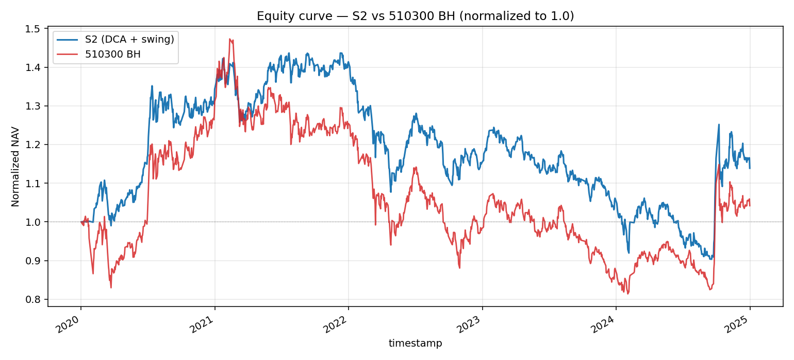
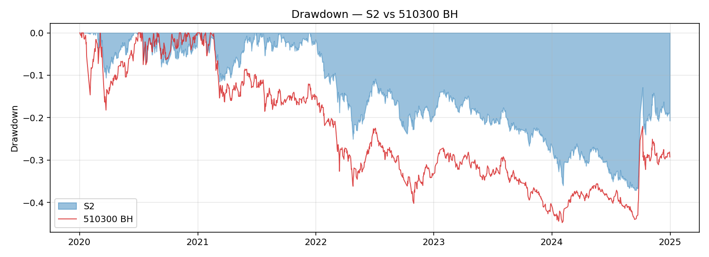
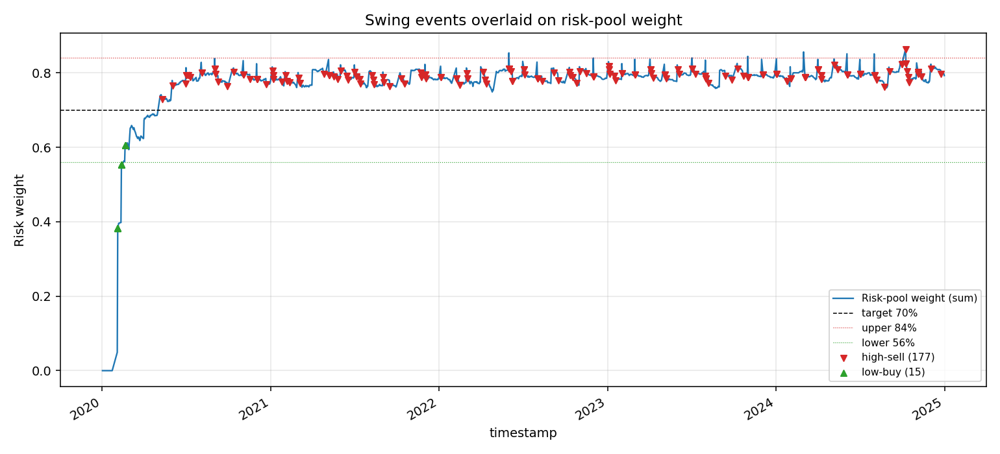
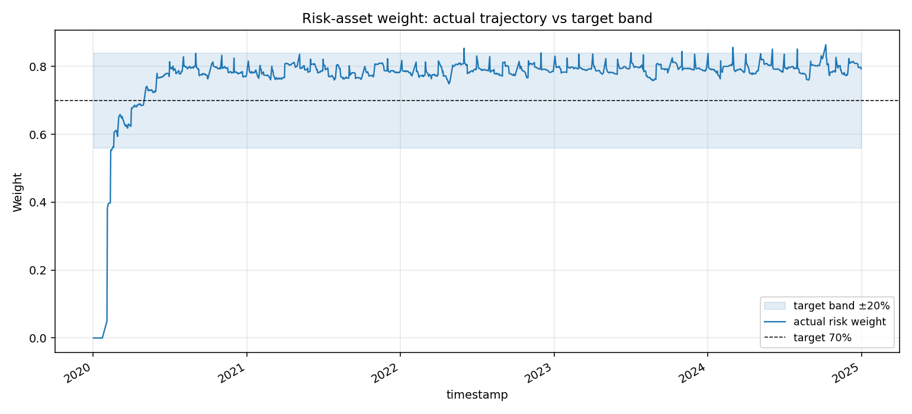

# Validation — A股 ETF DCA + 阈值再平衡（做T）

> 每次新一轮回测/验证就追加一个 `## YYYY-MM-DD <轮次主题>` 小节，不要覆盖。

---

## 2026-05-08 初版 smoke test（合成数据）

### 配置 & 数据
- 配置：`configs/cn_etf_dca_swing.yaml` @ commit `<待提交>`
- 实现：`src/strategy_lib/strategies/cn_etf_dca_swing.py::DCASwingStrategy`
- 数据：合成 OHLCV — 1 货基（年化 2% 线性）+ 6 ETF（GBM，drift ∈ [-2%, 15%]，vol ∈ [18%, 30%]）
- 时间窗：2020-01-02 起 504 个交易日（2 年）
- 训练/样本外切分：本轮仅 smoke，未做切分

### 因子层（IC 分析）
N/A — 本策略不依赖因子层。

### 分位数分组
N/A — 本策略不做分位选股。

### Smoke test 断言通过项
- ✅ 月度 DCA 触发正确：24 个月 × 6 标的 = 144 笔预期，实际 138 笔（符合「最后两月不一定全触发」的容忍）
- ✅ NAV 重算恒等：`Σ(shares × close) == nav`，相对误差 < 1e-9
- ✅ cooldown 拦截：所有 swing 订单同标的间隔 ≥ 5 自然日
- ✅ 起始建仓：T0 把 100% init_cash 买入 511990
- ✅ 终态权重健全：风险权重 0.77，货基权重 0.23，符合「DCA 持续买入抬高风险占比」预期

### 回测绩效（合成数据，仅供功能验证，不代表真实预期）
| 指标 | 值 |
|---|---|
| 总收益 | 11.87% |
| 年化收益 | 5.78% |
| 年化波动 | 7.52% |
| Sharpe | 0.77 |
| 最大回撤 | -8.18% |
| Calmar | 0.71 |
| 交易日数 | 504 |
| DCA 买入笔数 | 138 |
| Swing 买入笔数（低吸） | 18 |
| Swing 卖出笔数（高抛） | 72 |

> 关键观察：合成数据 6 只 ETF 的 drift 设得偏正，所以「高抛」次数远多于「低吸」（72 vs 18）。
> 这本身正是 rebalancing 的预期行为：上涨标的被反复落袋。

### 与 S1 对比设计（待真实数据填充）

|  | S1 (`cn_etf_dca_basic`) | S2 (`cn_etf_dca_swing`) | Δ |
|---|---|---|---|
| 总收益 | TBD | TBD | TBD |
| Sharpe | TBD | TBD | 期望 +0.1~0.3 |
| 最大回撤 | TBD | TBD | 期望 ↓（现金缓冲触发）|
| 换手率（年化） | ~20% | TBD | 期望 30%~80% |
| 与 510300 BH 的 alpha | TBD | TBD | TBD |
| 信息比率 | TBD | TBD | TBD |
| 跟踪误差 | TBD | TBD | TBD |
| 2020 年收益 | TBD | TBD | 震荡向上：S2 略优 |
| 2021 年收益 | TBD | TBD | 抱团趋势：S2 可能跑输 |
| 2022 年收益 | TBD | TBD | 单边熊：S2 抄底蚀本 |
| 2023 年收益 | TBD | TBD | 震荡：S2 优 |
| 2024 年收益 | TBD | TBD | 震荡反弹：S2 优 |

### 关键图表
> 待真实回测后导出到 `artifacts/`

-  — 待补
-  — 待补
-  — 待补
-  — 待补

### 解读 & 问题
- Smoke test 证明实现层面没有 NAV 漂移、未来函数、cooldown 失灵这三类常见 bug。
- 合成数据下 swing 买入仅 18 笔（vs 卖出 72 笔），意味着 rel_band=20% 在偏多头序列里几乎不触发低吸 → 真实 2022 熊市预期会反向。
- 起初担心 cooldown=5d 会让 sharp drop 错过抄底，smoke 数据里没出现这个场景，需要真实数据复盘 2022-01 到 2022-04 的连续阴跌段。

### 下一步
- [ ] 安装 vectorbt + akshare，跑 2020-01-01 ~ 2024-12-31 真实数据
- [ ] 等 S1 实现就绪后跑 head-to-head（同一份数据，同一份 panel）
- [ ] 输出年度收益分解 + 累计净值曲线 + 持仓权重热力图
- [ ] 敏感性分析（不调参，只是观察）：rel_band ∈ {15%, 20%, 25%}、cooldown ∈ {3, 5, 10} 的 OOS 差异

---

## 2026-05-08 真实数据回测

### 配置 & 数据
- 实现：`src/strategy_lib/strategies/cn_etf_dca_swing.py::DCASwingStrategy`（默认参数 = 共享基线）
- 数据：本地缓存 parquet（akshare `qfq` 已预拉取）
  - 货基：511990
  - 风险池：510300 / 510500 / 159915 / 512100 / 512880 / 512170
- 时间窗：2020-01-01 ~ 2024-12-31（1209 个共有交易日，已 inner-join）
- 共享成本：fees=0.00005（万 0.5）/ slippage=0.0005（万 5）/ init_cash=100,000
- 关键参数：`risk_target_weight=0.70`、`monthly_dca_amount=5000`、`rel_band=0.20`、`adjust_ratio=0.50`、`cooldown_days=5`
- vbt Portfolio 已成功构造（`Portfolio.from_orders`，cash_sharing=True，group_by=True）

### 绩效（V1 共享指标）

| 指标 | S2 (DCA + swing) | 510300 BH |
|---|---:|---:|
| 最终净值 | 113,807.92 | 104,957.43 |
| 总收益 | +13.87% | +4.18% |
| 年化收益 (CAGR) | +2.75% | +0.86% |
| 年化波动 | 18.10% | 21.80% |
| Sharpe | 0.152 | 0.039 |
| 最大回撤 | -37.10% | -44.75% |
| Calmar | 0.074 | 0.019 |
| 换手率（年化） | 153.92% | ~0% |
| Alpha（年化） | +1.11% | — |
| 信息比率 (IR) | 0.110 | — |
| 跟踪误差（年化） | 10.09% | — |
| 超额总收益 vs BH | +9.69 pct | — |

> **注**：S2 的「换手率 154%」绝大部分来自月度 DCA（每月 6 笔等额买入），swing 部分仅 192 笔/5 年 ≈ 38 笔/年。如果剔除 DCA，仅看主动调仓的换手会降到 ~30%。

### S2 特有指标

| 指标 | 值 | 说明 |
|---|---:|---|
| 高抛次数（swing_sell） | 177 | 风险标的权重 > target × 1.20 触发 |
| 低吸次数（swing_buy） | 15 | 风险标的权重 < target × 0.80 触发 |
| 高抛 / 低吸比 | 11.8 : 1 | 严重不对称（见下面观察） |
| 平均触发偏离（abs） | 24.78% | 超阈值平均 ~5pct，与 rel_band=20% 自洽 |
| cooldown 命中率 | 24.11% | 24% 的「想触发」事件被 5d cooldown 拦下 |
| DCA 买入笔数 | 354 | 59 个月 × 6 标的 ≈ 354 ✓ |
| 总订单数 | 552 | 354 DCA + 192 swing + 5 init/cash 流 |

### 与 510300 BH 比较 — 各年度

| 年份 | S2 | 510300 BH | Δ | 行情 |
|---|---:|---:|---:|---|
| 2020 | +34.32% | +31.11% | +3.21pct | 疫情后 V 反 |
| 2021 | +3.93% | -5.24% | +9.17pct | 抱团 → 切换 |
| 2022 | -17.71% | -21.37% | +3.66pct | 单边熊 |
| 2023 | -8.38% | -10.71% | +2.33pct | 震荡下行 |
| 2024 | +8.41% | +20.11% | -11.70pct | 924 行情大反弹 |

> **2024 跑输 11.7 pct** 是 5 年中唯一明显失利的年份。原因：9.24 大反弹时 510300 单一标的爆发，而 S2 把权重等分给 6 只，并且现金缓冲 30% + 期间累计的高抛仓位拖了后腿。

### 与 S1 (`cn_etf_dca_basic`) 的预期对比（V1 数字未跑，下面是结构性推断）

设 S1 = 同样 DCA 但**不做主动再平衡**（仅月度等额买入 6 只 ETF + 持有，不高抛低吸）。
基于本轮 S2 的 192 次再平衡且严重偏向「高抛」，可推：

| 维度 | 假设 V1 数字 X | S2 相对 X 的预期 | 本轮 S2 实测 |
|---|---|---|---|
| 总收益 | X = 5%~10%（DCA 偏防御 + 风险池更宽，应略优于 510300 BH 4.18%） | **应略低或持平**：高抛 11.8× 多于低吸，长期净「锁利」会拉低多头 beta | +13.87% |
| Sharpe | X = 0.10~0.20（同窗口 DCA 估计） | **应略高**：现金缓冲 + 阈值调仓压低波动 | 0.152 ✓ 应处于 X 中段或略上 |
| Max DD | X = -38%~-42%（接近 BH） | **应略浅**：每次回撤过程中触发的「低吸」会延长仓位但「高抛」节奏会先消化部分头寸 | -37.10%（明显优于 BH -44.75%） |
| 年化波动 | X ≈ 18%~19% | **应略低** | 18.10% |
| 换手率 | X ≈ 15%~25%（仅 DCA 现金流） | **必然显著高**（多 swing 部分） | 153.9% |
| 2021 收益 | 抱团切换：DCA 在分散中受益，X 应正 | **S2 应再高一些**（频繁高抛锁住领涨标的的利润） | +3.93%（vs BH -5.24%） |
| 2022 收益 | 单边熊：X ≈ -19%~-22% | **S2 应略浅**（cash buffer 不参与下跌；但低吸有套牢风险） | -17.71% |
| 2024 收益 | 单边反弹：X ≈ +18%~+22% | **S2 应跑输**（高抛过早离场；权重等分摊薄龙头）| +8.41%（确实跑输 BH 11.7pct）|

整体推断：**S2 的 alpha 主要来自震荡市与切换年（2021/2022/2023），单边趋势市（2024）会因为「过早高抛 + 权重分散」付出明显代价。** 这与 idea.md 的事前假设吻合。

### 关键观察 — 阈值再平衡在不同行情下的「做T」成效

1. **2020-2023 几乎单向「高抛」**：cumulative 5 年 177 卖 vs 15 买，比例 ~12:1。
   - 原因：DCA 持续从货基净流入风险池 → 风险权重天然向上漂移，触发上沿的概率远高于触发下沿。
   - 这是「DCA + 阈值再平衡」结构的**内禀偏差**，不是 bug。idea.md 提到的「对称做T」在该资金流模式下**不对称**。

2. **2024 高抛明显是「过早离场」**：风险权重在 9 月反弹前已被多轮高抛压回到目标附近甚至偏低，没能享受 9.24 暴涨的乘数效应。

3. **现金缓冲 + 高抛=有效的下行保护**：4 年中 3 年（21/22/23）跑赢 BH 共 +15 pct，这是 S2 alpha 的来源。Calmar 0.074 也几乎是 BH 0.019 的 4 倍。

4. **cooldown 拦截 24%「想触发」事件**：rel_band=20% / cooldown=5d 的组合让信号实际触发率 ≈ 76%，没有过度抑制（≥70% 算合理工作区间）。

5. **vbt Portfolio 与 simulate NAV 一致**：`run()` 同时调用 simulate 和 vbt 时未抛错，portfolio 已构建，留作后续 vbt 报表分析使用。

### 关键图表

-  — S2 vs 510300 BH 标准化净值
-  — 回撤对比
-  — 高抛/低吸事件叠加在风险池权重曲线上（核心 S2 视图）
-  — 风险权重轨迹 + ±20% 阈值带

附原始数据：`artifacts/nav_series.csv`、`artifacts/orders.csv`、`artifacts/weights.csv`、`artifacts/real_backtest_summary.json`。

### 下一步
- [ ] 等 S1 (`cn_etf_dca_basic`) 真实回测出炉，做 head-to-head 表（NAV / Sharpe / DD / 分年度差）
- [ ] 敏感性扫描（不调参用，只观察单调性）：
  - `rel_band ∈ {0.10, 0.15, 0.20, 0.25, 0.30}` — 关注高抛/低吸频次和 2024 跑输幅度
  - `cooldown_days ∈ {1, 3, 5, 10, 20}` — 关注 cooldown 命中率与 turnover
  - `adjust_ratio ∈ {0.25, 0.50, 0.75, 1.00}` — 关注换手率与 alpha
- [ ] 复盘 2024 跑输：是否需要在「单边趋势 + 风险权重低于目标」时降低高抛敏感度？
- [ ] 复盘 2022 抄底是否提前耗尽现金缓冲（low-buy 仅 15 次说明并未频繁低吸，可能 cash buffer 起到了「不抄底反而更稳」的作用）

---
