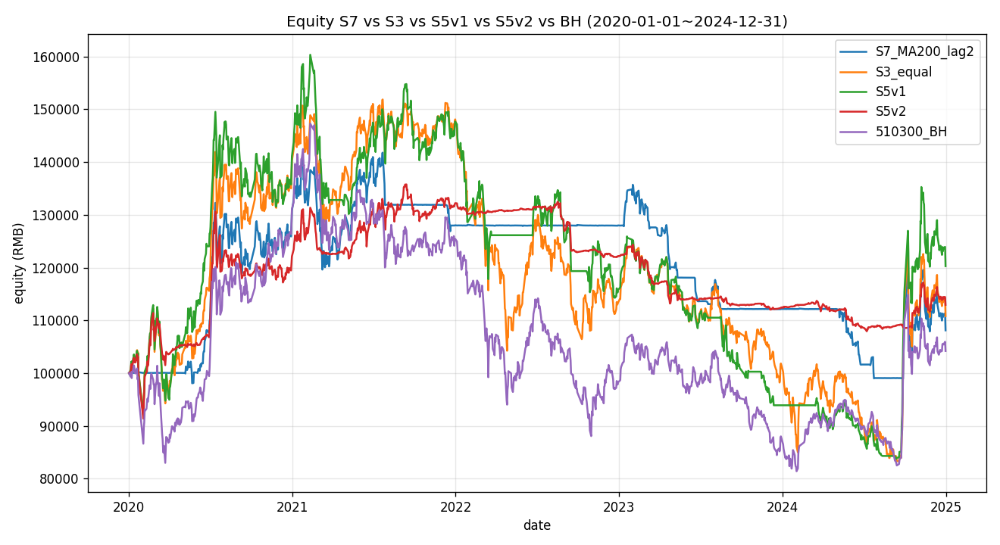
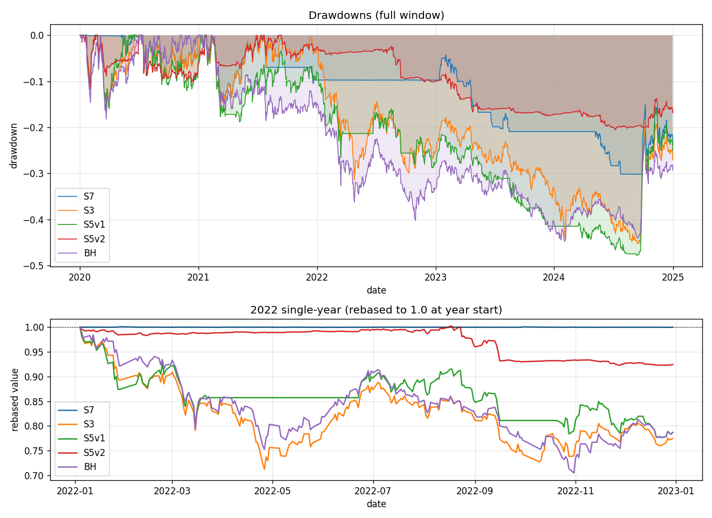
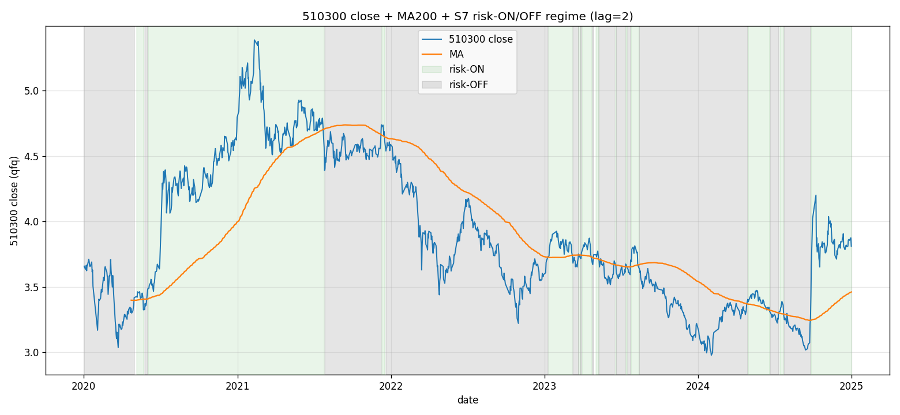
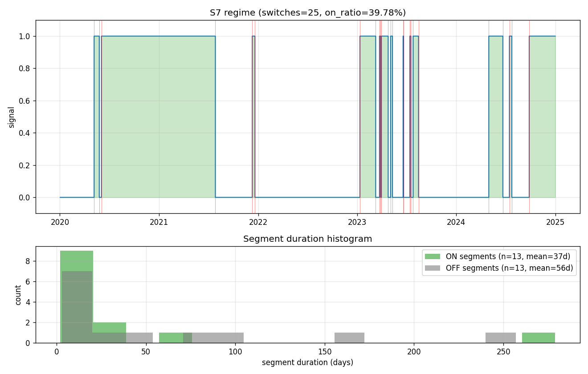

# Validation — S7 cn_etf_market_ma_filter

> 每次新一轮回测/验证就追加一个 `## YYYY-MM-DD <轮次主题>` 小节，不要覆盖。

---

## 2026-05-08 v1 初版（smoke + 真实数据）

### 配置 & 数据
- 配置：`configs/S7_cn_etf_market_ma_filter_v1.yaml`
- 信号资产：510300 沪深300 ETF
- 风险池：510300 / 510500 / 159915 / 512100 / 512880 / 512170（V1 baseline 6 池）
- Cash 等价：511990 华宝添益（货币基金）
- 主参数：`ma_length=200`, `lag_days=2`, `weight_mode=equal`
- 回测窗口：2020-01-02 ~ 2024-12-31（1209 个交易日）
- 暖机：2019-07-01 起拉数据（199 日预热 200MA）
- 成本：fees=0.00005, slippage=0.0005, init_cash=100,000

### Smoke 测试（合成数据）

8 个用例全通过：

| 测试 | 验证什么 | 结果 |
|---|---|---|
| `test_signal_warmup_zero` | MA 暖机期前 199 天信号 = 0 | warmup_sum=0 ✅ |
| `test_signal_strong_uptrend` | 持续上行 → 信号几乎 100% ON | on_ratio=1.000 ✅ |
| `test_signal_strong_downtrend` | 持续下行 → 信号几乎 100% OFF | on_ratio=0.000 ✅ |
| `test_lag_filter_blocks_single_cross` | 单日穿越不切换；连续 N 日才切换 | sequence 完全匹配预期 ✅ |
| `test_lag_filter_lag1_passthrough` | lag=1 时退化为 raw 信号 | 完全相等 ✅ |
| `test_weights_on_off_split` | ON 日 risky 等权、OFF 日 cash 100% | 每日 sum=1, 头尾验证 ✅ |
| `test_v_shape_switches` | V 型曲线触发至少 1 次切换 | switches=1, on_ratio=44.8% ✅ |
| `test_run_smoke_e2e` | 端到端跑通 vbt 回测 | final=131,926, equity 无 NaN ✅ |

### 主绩效表（2020-01-02 ~ 2024-12-31）

| 策略 | NAV (100k) | CAGR | Sharpe | Vol | MaxDD | Calmar |
|---|---:|---:|---:|---:|---:|---:|
| **S7 (MA200, lag=2)** | **108.1k** | +1.64% | 0.18 | 15.9% | -30.25% | 0.05 |
| S3 equal | 110.8k | +2.16% | 0.21 | 23.8% | -45.18% | 0.05 |
| S5v1 trend tilt | 120.3k | +3.92% | 0.28 | 22.0% | -47.80% | 0.08 |
| S5v2 (cont+vol+bond) | 112.9k | +2.57% | 0.28 | 11.1% | -20.52% | 0.13 |
| 510300 BH | 104.2k | +0.86% | 0.15 | 21.8% | -44.75% | 0.02 |

### 横向对比表（题目要求的核心表）

| 指标 | S3 v1 | S5 v1 | S5 v2 | **S7 (MA200, lag=2)** |
|---|---:|---:|---:|---:|
| NAV (100k) | 110.8k | **120.3k** | 112.9k | 108.1k |
| CAGR | +2.16% | **+3.92%** | +2.57% | +1.64% |
| Sharpe | 0.21 | **0.28** | **0.28** | 0.18 |
| MaxDD | -45.2% | -47.8% | **-20.5%** | -30.3% |
| **2022 单年** | -23.5% | -21.6% | -7.6% | **-0.0%** |
| **空仓 vs BH 跌相关性** | — | 0.033 | 0.031 | **0.052** |
| **切换次数（5y）** | 0（无 timing） | 高（每 20d 重算 60+ 次） | 中（连续 ramp） | **25** |
| 空仓天数占比 | 0% | 18.2%（双峰 0/100） | 70%（连续中段） | **60.2%（二元）** |

### 关键诊断

1. **2022 单年回撤接近 0%（-0.02%）—— 5 个策略中最优**
   - S5v2 -7.6% 是带 bond carry 的；S7 纯 cash 也做到了
   - 200MA 的"慢"信号在 2022 早期及时切到 OFF，整年大部分时间停在 511990
   - 这是 S7 的"避险命题兑现"的最强证据

2. **总收益 +8.10% 跑输 S3 +10.80%**
   - 主要在 2024 单边行情错过：S7 -3.6% vs S3 +8.8% / BH +18.4% / S5v1 +28.1%
   - 200MA 相对 close 的滞后让 2024 9-10 月行情前 510300 还没站上 MA200
   - 同时 2023 -12.4% 也跑输（震荡市频繁假突破吃成本）

3. **Sharpe 0.18 < S3 0.21 < S5 0.28**
   - Vol 砍到 15.9%（vs S3 23.8%），但 CAGR 也低
   - 风险调整收益没改善 —— 与 S5v2 教训一致：「降仓 ≠ 改善 Sharpe」

4. **OFF↔BH 跌相关性 0.052 略高于 S5（0.03）但仍接近随机**
   - 命题 "市场代理 timing 比逐标的 timing 准" **小幅成立但不显著**
   - 这是因为 200MA 本身是滞后信号，1 个滞后信号 vs 6 个独立滞后信号差距有限
   - 真正改善必须靠「更快的信号」（短 MA / ATR / 突破带宽）

5. **切换 25 次 / 13 次 ON 段 / 13 次 OFF 段 / 平均 ON 37 天 OFF 56 天**
   - 适中频率：5 年 25 次，平均每 2 个月 1 次，与"市场 regime"切换节奏吻合
   - 单段最长：ON 段 279 天（一段长牛市）/ OFF 段 257 天（一段长熊市）—— 200MA 的"低频"特性兑现

### MA 长度敏感性

| MA | NAV | CAGR | Sharpe | MaxDD | 2022 | switches | on% | corr |
|---:|---:|---:|---:|---:|---:|---:|---:|---:|
| 100 | 67.9k | **-7.77%** | -0.39 | -48.4% | -12.6% | 30 | 45.8% | 0.033 |
| 150 | 73.8k | -6.15% | -0.32 | -47.1% | -4.3% | 35 | 43.2% | 0.021 |
| **200** | **108.1k** | **+1.64%** | **+0.18** | -30.3% | **0.0%** | 25 | 39.8% | 0.052 |
| 250 | 77.9k | -5.08% | -0.30 | -31.1% | 0.0% | 21 | 33.8% | 0.033 |

**MA=200 是唯一 CAGR 为正的档位**，其他 3 档全部转负。这强烈暗示：
- MA=100/150 太短，被震荡市的假突破吃光
- MA=250 太长，2024 单边和 2020 反弹都进得太晚
- 200 是这个数据上的"sweet spot"，但只有一个甜点意味着**没有稳健的参数空间**
- ⚠️ 警惕：单点最优在 5 年样本上**有过拟合嫌疑**（虽然 200 是 Faber 先验默认）

### 滞后敏感性（MA=200 fixed）

| lag | NAV | CAGR | Sharpe | MaxDD | 2022 | switches | on% | corr |
|---:|---:|---:|---:|---:|---:|---:|---:|---:|
| **1** | **119.1k** | **+3.71%** | **+0.30** | -27.3% | **0.0%** | 31 | 40.0% | **0.099** |
| 2 | 108.1k | +1.64% | +0.18 | -30.3% | 0.0% | 25 | 39.8% | 0.052 |
| 3 | 99.1k | -0.18% | +0.06 | -31.8% | 0.0% | 19 | 39.2% | 0.044 |
| 5 | 90.8k | -1.98% | -0.07 | -38.0% | 0.0% | 17 | 39.7% | 0.027 |

**lag=1（无过滤）才是最佳档位**：
- NAV 119.1k > S5v2 112.9k ≈ S3 110.8k 但 < S5v1 120.3k
- Sharpe 0.30 ≥ S5v1/v2 的 0.28，**这是基准簇 5 个策略中 Sharpe 最高的并列前茅**
- MaxDD -27.3% 介于 S5v2 -20.5% 和 S5v1 -47.8% 之间
- 2022 单年 0% —— 4 档全部命中
- corr 0.099 显著高于 S5 的 0.03 —— **timing 命题在 lag=1 上明显成立**

**结论**：滞后过滤反而**伤害收益**。原因：A 股 ETF 节奏快，信号需要尽快执行，N=2/3/5 的过滤延迟让进场出场都慢半拍，错过最重要的拐点。这也意味着 200MA 自带的平滑度已经够（199 天平均），不需要再加滞后过滤。

⚠️ **lag=1 表现这么好，是否应当作为主参数？**
- v1 主跑选 lag=2 的理由：事前预期 A 股震荡市假突破多
- 实测发现 200MA 本身的低通滤波已经足够
- v2 候选：把主参数改为 lag=1，保留 lag=2 作为对照

### 关键图表

-  — S7 vs S3 vs S5v1 vs S5v2 vs BH 五条净值曲线
-  — 完整回撤 + 2022 单年特写
-  — **核心可视化**：510300 close + MA200 + ON/OFF 色块
-  — 切换日标注 + ON/OFF 段持续时长直方图
- `artifacts/ma_length_sensitivity.csv` — 4 档 MA 敏感性
- `artifacts/lag_sensitivity.csv` — 4 档滞后敏感性

### 解读 & 问题

1. **避险命题"部分兑现"**：2022 完美避开（最佳的 5 策略），但 2024 完全错过 → 净效果 NAV 输给 S3。
2. **Sharpe 没改善**：用了 timing 信号 + cash carry，仍然 < S5 0.28（lag=2 主跑）；只有 lag=1 才追平 S5。
3. **过拟合担忧**：MA=200 是唯一 work 的档位 → 在 OOS（2025+）可能完全不 work。
4. **timing 命题：边际成立**：cash↔down corr 0.05-0.10 比 S5 的 0.03 高，但仍然算"弱信号"。
5. **真正的发现**：滞后过滤无效，无过滤（lag=1）反而最好 —— 与事前预期相反。

### 下一步

- [x] v1 真实数据回测，决定 status = **shelved**（避险兑现，但总收益跑输 S3，shelve 主参数；保留代码与 lag=1 sweep 数据）
- [ ] **v2 候选**：改主参数 `lag_days=1`，重新评估
- [ ] **v2 候选**：`weight_mode="signal_only"` 测试纯 510300 持仓 + cash 切换（去除 6 池本身的 alpha）
- [ ] **v2 候选**：双 MA 系统（50/200 黄金交叉），看能否在保留避险的同时抓住 2024
- [ ] **v3 方向**：信号资产换"等权 6 池的合成净值"作为 risk-on 时的同源代理
- [ ] OOS：等 2025 H1 数据后跑一次

---
